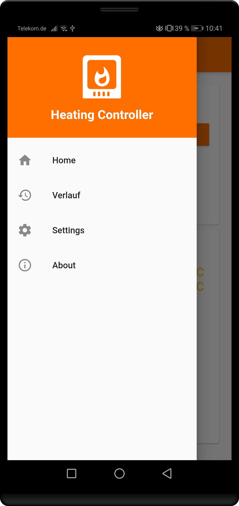
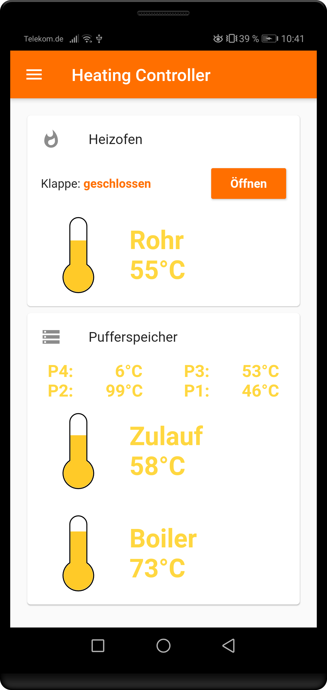
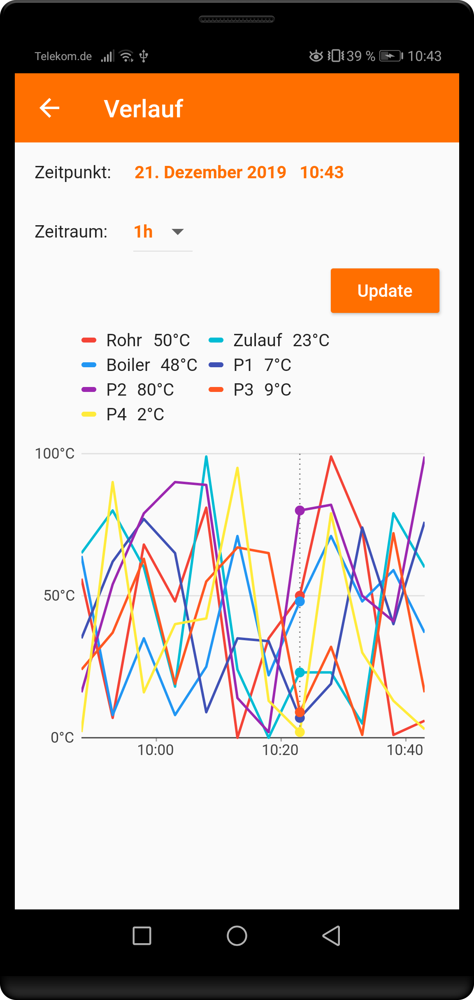
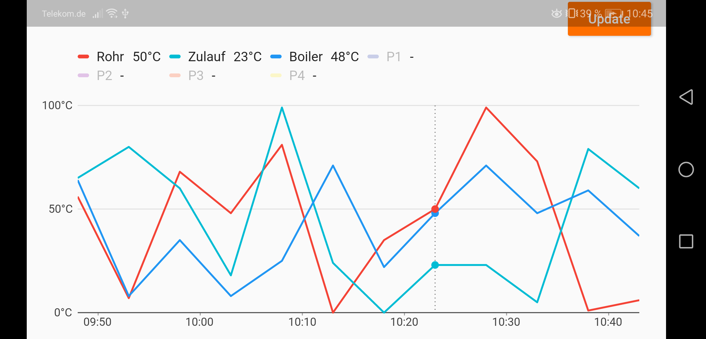

# Heating Controller

## Description
The app was developed with the Framework Flutter as a result of project at our university. 
The aim of this app is to visualize different values of a heating system. Additionaly, the furnace's hatch can be opened.

## Pages
The following images were taken in German, but the app is also translated to English.
### Home
Displays the current values. If the hatch is closed it is possible to open it. Making a pull to refresh gesture will force an immediate update of the database. 
  

### History
The history page shows the measurements in a specified time intervall. The different chart entries can be hidden by clicking on the corresponding legend entry.
  

  

### Settings
Here you can switch between Demo and Prod Mode. In Demo Mode, the values are created randomly and there is no connection to any webserver. In Prod Mode, you can also select which connection the app should use - IP or VPN address.
  

